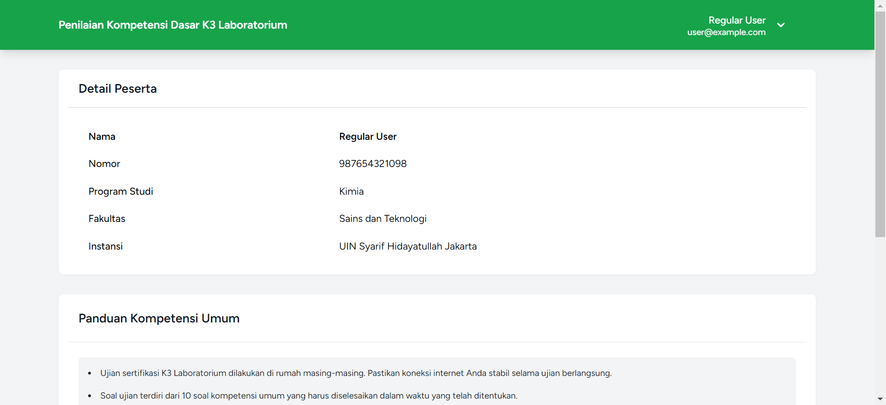

# Website for Basic Laboratory K3 Competency Assessment

This project aims to optimize the laboratory center at UIN Syarif Hidayatullah Jakarta through the assessment of basic K3 competencies.

## Key Features

### For Users

- **Login:**
  Users can log in using the username and password provided by the admin.

- **Certification Exam:**
  Users can take the certification exam after successful login.

- **Participant Data Access:**
  Users have access to view participant data after successful login.

- **Certificate Access:**
  Users can access their certificates after passing the exam.

### For Admins

- **Login:**
  Admins can log in to the system to manage the project.

- **Participant Data Access:**
  Admins have access to view participant data who have logged in.

- **Certificate Access:**
  Admins can access certificates of participants who have passed the exam.

- **Exam Question Management:**
  Admins can manage certification exam questions.

- **Participant Account Management:**
  Admins can manage participant accounts, including access rights and password resets.

## Website Demonstration

Check out the video demonstration of the website: ((https://s.id/demontration-web).

## Contribution

We welcome contributions from the community. If you would like to contribute to this project, please open a new issue or submit a pull request after making changes.

## License

This project is licensed under the MIT License. See the [LICENSE](./LICENSE) file for details.

## Contact

For further questions or technical support, please contact us at [falihrahmat534@gmail.com](mailto:falihrahmat534@gmail.com).

Visit our website: [Basic Laboratory K3 Competency Assessment](https://kompetensi.puslab.net)

